# DBS302 – Practical 3

## Design and Implement an E-Commerce Platform Schema in MongoDB using MongoDB Compass

## Introduction

MongoDB is a NoSQL, document oriented database that stores data in flexible JSON-like documents. It allows dynamic schema design, making it suitable for applications like e-commerce systems where product structures and user data can vary.

In this practical, MongoDB Compass (GUI tool) was used to design and implement an e-commerce database, perform aggregation queries for analytics and optimize query performance using indexes.

## Objectives

* Design an e-commerce schema using MongoDB
* Implement collections and insert sample data
* Perform aggregation queries using the Aggregation Framework
* Optimize queries using indexing and explain plans

## Tools Used

* MongoDB Compass

## Database Design

The database `ecommerce` consists of the following collections:  
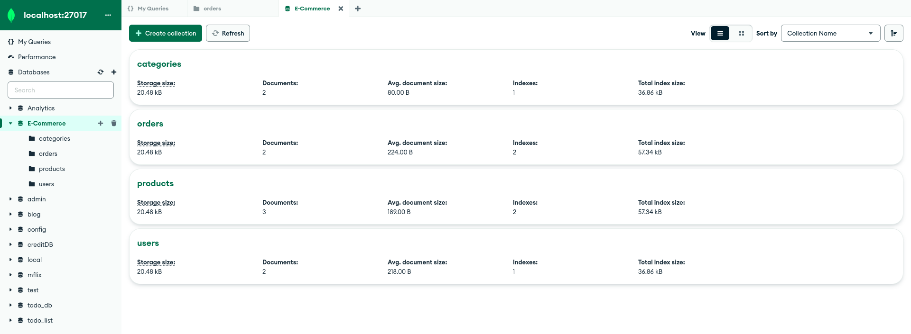  

### 1. Users Collection
Stores basic customer information.  

Fields:

* name
* email
* phone
* address (embedded document)
* createdAt

**Users Collection with Documents**
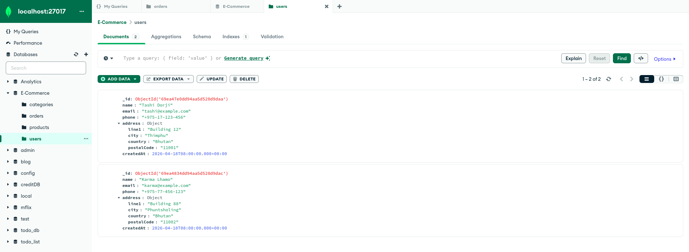  

### 2. Categories Collection
Stores product categories.  

Fields:

* name
* slug
* parentCategoryId

**Categories Collection with Documents**
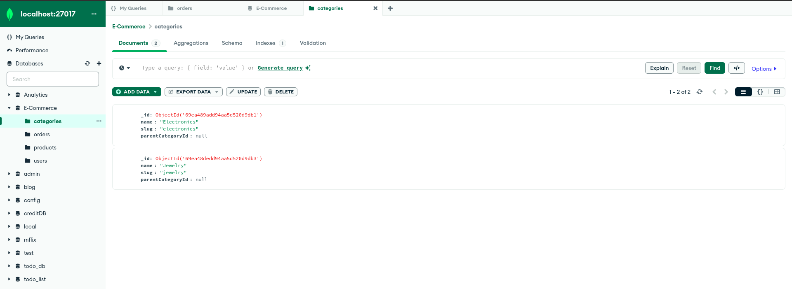  

### 3. Products Collection
Stores product catalog entries. This collection demonstrates the Attribute Pattern to store variable attributes in a key‑value structure.

Fields:

* name
* categoryId (reference)
* price
* currency 
* stock
* attributes (dynamic fields like brand and color)

**Products Collection with Documents**
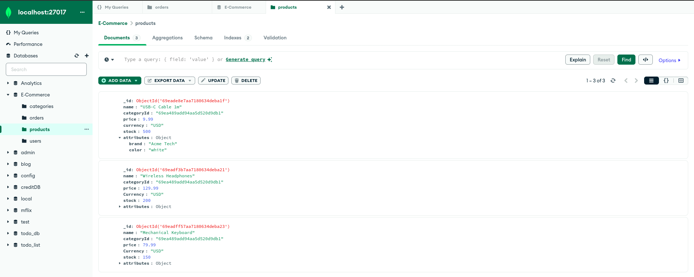  

### 4. Orders Collection
Stores orders with embedded order items. Embedding is used because order items are tightly bound to the order and are usually read together.

Fields:

* userId (reference)
* status
* items (embedded array)
* grandTotal
* createdAt

**Orders Collection with Documents**
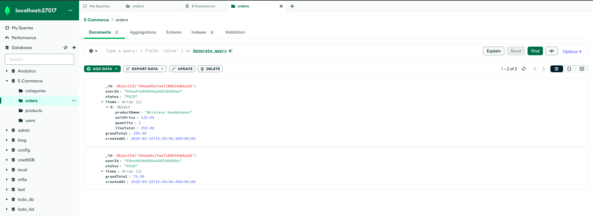    

I created the E-Commerce database and the Users, Categories, Products and Orders collections. Then inserted representative sample documents. All collections and sample data were verified in MongoDB Compass.

## Aggregation Queries
Aggregation pipelines were executed using the Aggregations tab in MongoDB Compass.

### 1. Daily Sales Total
This query calculates total revenue and number of orders per day.

**Daily Sales Aggregation Result**
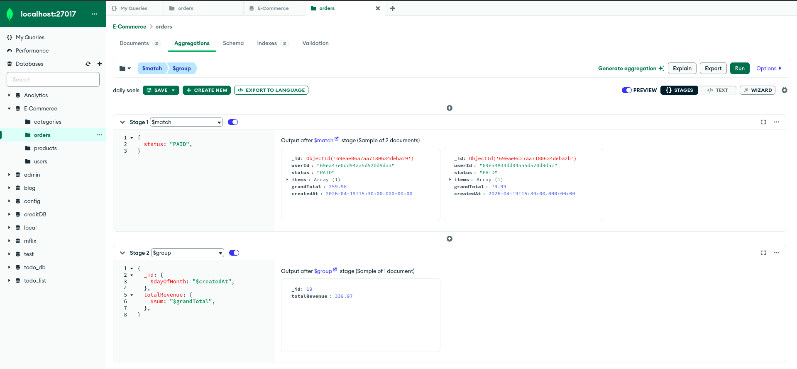    

### 2. Top N Products by Revenue
This query identifies top-selling products.

**Top Products Aggregation Result**
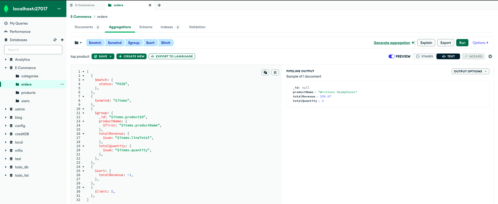    

### 3. Average Order Value per User
This query calculates user spending behavior.

**Average Order Aggregation Result**
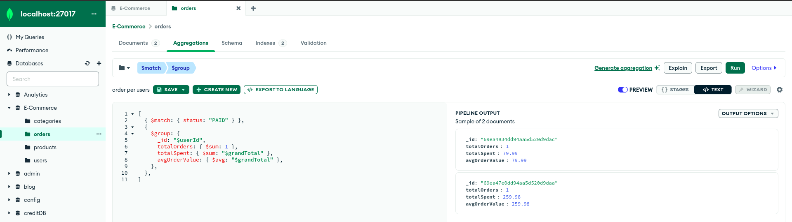    

### 4. Products with Category Name
List products with their category name and some attributes.  

**Product + Category Aggregation Result**
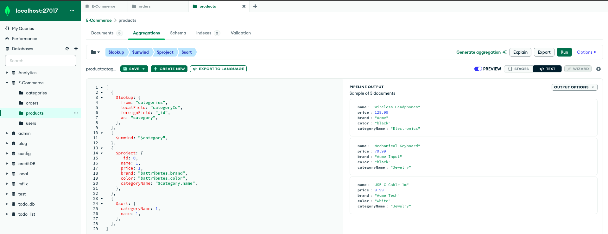    

## Indexing

Indexes were created using the **Indexes tab in MongoDB Compass** to improve query performance.

### Indexes Created:

* Orders:

  * userId + createdAt
  * status + createdAt

**Index Creation in Orders Collection**
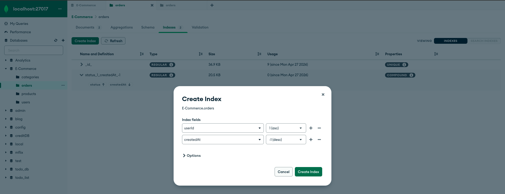  

* Products:

  * categoryId + price  

**Index Creation in Products Collection**
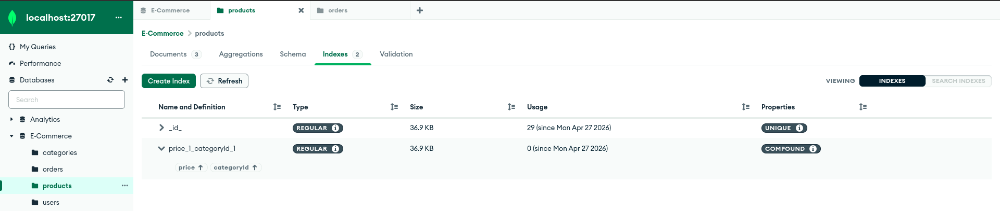  

## Query Performance Analysis using Explain Plan

MongoDB Compass provides an Explain Plan feature to analyze query performance.

**Explain Plan**
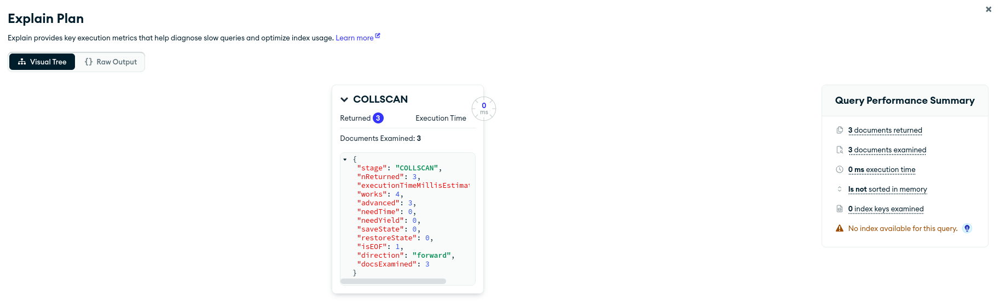  

## Challenges Faced
* Understanding aggregation pipeline stages
* Managing ObjectId references between collections
* Identifying correct fields for indexing

## Conclusion
This practical provided hands-on experience with MongoDB schema design, aggregation framework and query optimization. Using MongoDB Compass made it easier to visualize data and analyze query performance. The use of indexing and explain plans demonstrated how performance can be significantly improved in real-world applications.

